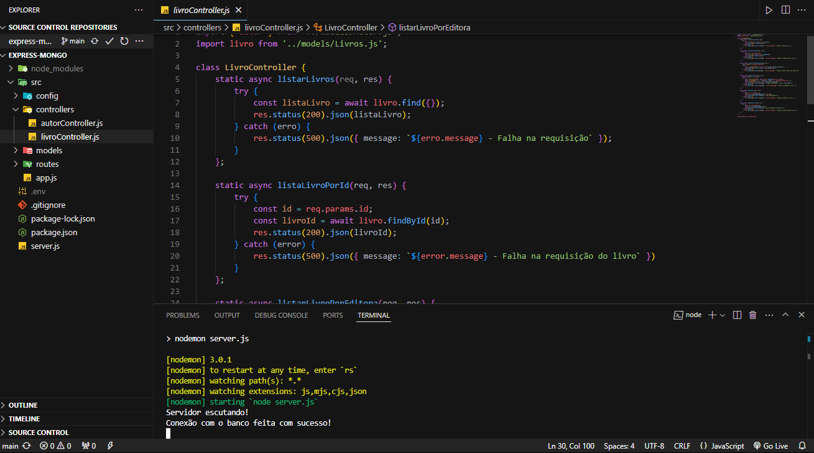

# Livraria

> Desenvolvimento de um sistema de biblioteca onde o usuário pode registrar um livro e seu autor, realizar buscas, excluir e atualizar informações.

## 💻 Pré-requisitos

Antes de começar, verifique se você atendeu aos seguintes requisitos:

- npm instal - para estalar a pasta node_module
- Crie uma variável no arquivo .env para estabelecer a conexão com o banco de dados MongoDB (DB_CONNECTION_STRING - Nome da variável).
- npm run dev - Para rodar a aplicação
